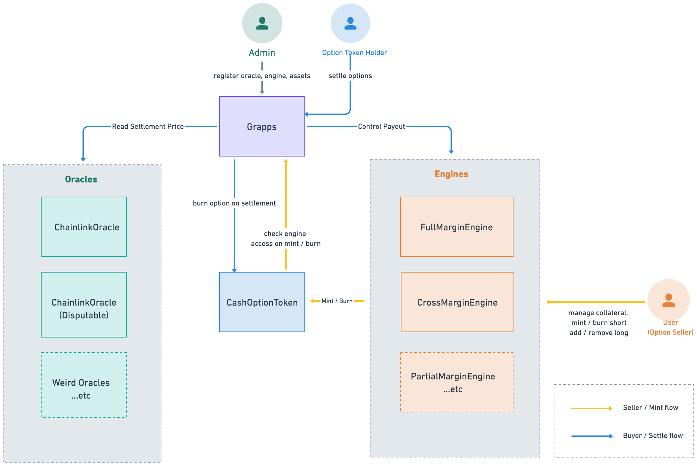

# Contract Architecture

## System Diagram

This diagram provides a high-level view of how all the contracts interact with each other.

The architecture primarily comprises two main contracts: `Grappa`, `CashOptionToken`, and two sets of contracts: oracles and margin engines.

## `Grappa.sol`

`Grappa.sol` functions as the system's registry with an owner role to add assets, oracles, and engines into the system.

Currently, Grappa is upgradeable to accommodate potential short-term expansions in the "Option Tokens" definition to support other derivatives. Once we gain enough confidence in the contract form, we will remove this upgradeability.

Grappa is also responsible for settling the options after expiry. Once an optionToken is created by the engine, `Grappa` acts as a fair clearinghouse to determine the settlement price. Each engine must adhere to the interface to pay out to users accordingly.

## `CashOptionToken.sol`

`CashOptionToken` is an ERC1155 token representing the right to claim a non-negative payout at expiry. It can signify a long call position, a long put position, or debit spreads. How the ID of an option token is interpreted is determined by the Grappa contract at settlement.

## Oracles

The Grappa Owner can register multiple oracles in the system. Oracles are contracts that can be used to determine the settlement price. Different users/protocols may prefer to settle with different oracles.

## Margin Engines

**Margin Engines** are contracts that establish the rules for collateralizing option tokens. Tokens minted by different engines are not fungible, thereby isolating the risks. Multiple margin engines should work together to offer users flexibility based on their preferences such as gas fees, capital efficiency, composability, and risk.

### List of Margin Engines (Repos)

- [Fully Collat Margin Engine](https://github.com/grappafinance/full-collat-engine):
  - Covers call (collateralized with underlying)
  - Puts (collateralized with strike)
  - Call spread (collateralized with strike or underlying)
  - Put spread (collateralized with strike)

- [Cross Margin Engine](https://github.com/grappafinance/cross-margin-engine):
  - Uses a single subAccount to hold multiple collateral, long, and short positions.
  - Upgradable and maintained by the Hashnote team
  - Allows a single account to collateralize an arbitrary number of short positions, and offset requirements with long positions.
  - Currently, it fully collateralizes all positions. It may be expanded to partial collateral in the future.
  - Does not support spread tokens

- [Partial Collat Engine](https://github.com/grappafinance/partial-collat-engine): Mints partially collateralized options, which are 3x - 20x more capital-efficient compared to fully collateralized options. It requires dependencies on vol oracle to estimate the value of the option. Each subAccount can process:
  - Single collateral type
  - Can mint one call (or call spread) + one put (or put spread) in a single account.
  - Some known issues are still WIP. (See Github Issues)
